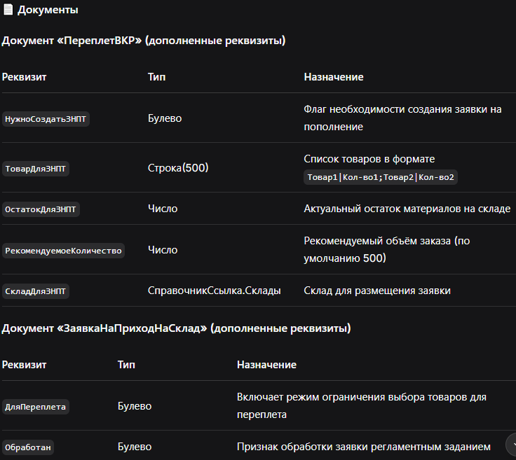

-------4.26.36.1--------
Комплексная система управления материалами для переплета и автоматизация создания заявок на пополнение склада
📌 Аннотация
В рамках релиза 4.26.36.1 реализован полный цикл управления материалами для переплета — от контроля остатков на складе до автоматического формирования приходных документов. Система объединяет документы «ПереплетВКР», «ЗаявкаНаПриходНаСклад» и «ПриходнаяНакладная» в единый бизнес-процесс, минимизируя ручной труд и исключая ошибки, связанные с нехваткой материалов.

🎯 Основные цели релиза
Цель	Описание
Автоматизация контроля остатков	Исключение проведения документов при нехватке материалов
Ускорение создания заявок	Снижение временных затрат на формирование заявок на пополнение
Ограничение выбора товаров	Предотвращение ошибочного выбора материалов для переплета
Автоматическая обработка заявок	Сокращение ручного труда при создании приходных накладных
🆕 Новые объекты метаданных

🔄 Бизнес-процесс
text
┌─────────────────────────────────────────────────────────────────────┐
│                    ДОКУМЕНТ «ПЕРЕПЛЕТВКР»                         │
│                                                                   │
│  1️⃣  Проверка остатков материалов (папки, скобы)                 │
│                                                                   │
│  2️⃣  Остаток < требуемого?                                       │
│         ├─ Да → Документ записывается (НЕ ПРОВОДИТСЯ)            │
│         │        Задаётся вопрос о создании заявки                │
│         │        Пользователь соглашается → Создание ЗНПТ         │
│         └─ Нет → Документ проводится                             │
└─────────────────────────────────────────────────────────────────────┘
                              │
                              ▼
┌─────────────────────────────────────────────────────────────────────┐
│               ДОКУМЕНТ «ЗАЯВКАНАПРИХОДНАСКЛАД»                    │
│                                                                   │
│  3️⃣  Автоматически заполняется реквизит «ДляПереплета» = Истина  │
│                                                                   │
│  4️⃣  Контроль выбора товаров:                                     │
│       • «ДляПереплета» включена → только вид «ТоварыДляПереплета» │
│       • «ДляПереплета» выключена → все, кроме этого вида          │
│                                                                   │
│  5️⃣  Проведение заявки → формирование движений                    │
│       по регистру «УчетМатериаловПереплета»                       │
│                                                                   │
│  6️⃣  Ожидание обработки регламентным заданием                    │
└─────────────────────────────────────────────────────────────────────┘
                              │
                              ▼
┌─────────────────────────────────────────────────────────────────────┐
│              РЕГЛАМЕНТНОЕ ЗАДАНИЕ «ОБРАБОТКА ЗАЯВОК»             │
│                                                                   │
│  7️⃣  Поиск необработанных заявок (Обработан = Ложь)              │
│                                                                   │
│  8️⃣  Создание документа «ПриходнаяНакладная» с переносом товаров  │
│                                                                   │
│  9️⃣  Отметка заявки как обработанной (Обработан = Истина)        │
└─────────────────────────────────────────────────────────────────────┘
⚙️ Основные возможности
✅ Контроль остатков материалов
При проведении документа «ПереплетВКР» система автоматически:

Суммирует потребность в материалах из табличной части

Получает актуальные остатки из регистра «УчетМатериаловПереплета»

Сравнивает и принимает решение:

Остаток < требуемого → документ записывается, но не проводится

Остаток ≥ 100 шт. → документ проводится в штатном режиме

0 < Остаток < 100 → документ проводится, предлагается создать заявку

📝 Создание заявки на пополнение
При недостатке материалов пользователю предлагается:

Создать заявку на пополнение склада

Заявка формируется с заполненными реквизитами:

ДляПереплета = Истина

Склад = Справочники.Склады.ЭБ

Товары: папки и/или скобы (объединены в один документ)

🛡️ Ограничение выбора товаров для переплета
В документе «ЗаявкаНаПриходНаСклад» реализована интеллектуальная фильтрация:

Режим	Разрешённые товары	Запрещённые товары
ДляПереплета = Истина	Только вид «ТоварыДляПереплета»	Все остальные
ДляПереплета = Ложь	Все товары	Вид «ТоварыДляПереплета»
Механизмы контроля:

При выборе товара в табличной части

При изменении состояния галочки

В форме подбора товаров

🤖 Регламентное задание
Автоматическая обработка заявок выполняется в фоновом режиме:

Расписание: настроено администратором (рекомендуется 5 минут)

Действия:

Поиск необработанных заявок
Создание приходных накладных
Отметка заявок как обработанных
Логирование: все операции фиксируются в окне сообщений

🔮 Перспективы развития
📊 Настройка пороговых значений через константы

📧 Уведомления ответственных лиц о создании заявок

✍️ Заключение
Релиз 4.26.36.1 полностью автоматизирует процесс управления материалами для переплета, обеспечивая:

✅ Надёжность – контроль остатков на каждом этапе

✅ Скорость – мгновенное создание заявок

✅ Безопасность – ограничение выбора товаров

✅ Эффективность – автоматическая обработка заявок

Система становится более интеллектуальной и дружественной к пользователю, освобождая сотрудников от рутинных операций и минимизируя вероятность ошибок.

-------3.07.20.26--------

1. Автоматическая проверка обновлений из GitHub
Добавлен общий модуль ПроверкаОбновленийСервер с логикой HTTP-запроса к GitHub API для получения последнего релиза.

Создано регламентное задание «Проверка обновлений», выполняющееся с заданной периодичностью (по умолчанию раз в сутки).

Реализовано сравнение версии конфигурации с версией из репозитория (поле name или tag_name ответа GitHub).

Добавлен регистр сведений РезультатыПроверкиОбновлений для хранения результатов проверки и статуса прочтения пользователем.

При старте системы пользователю показывается оповещение, если обнаружена новая версия (через функцию ПолучитьНепрочитанныйРезультатПроверки).

2. Гибкая настройка через константы
Созданы константы:

РепозиторийОбновленийURL – адрес API GitHub (или ссылка на текстовый файл с версией)

ТокенДоступаGitHub – токен для приватных репозиториев (опционально)

EmailАдминистратора – для уведомлений (опционально)

ИспользоватьGitHubAPI – флаг для выбора способа получения версии

ПериодПроверкиОбновлений – интервал в часах

ПутьКПроверкеОбновлений – путь к внешней обработке (если используется)

При обновлении до версии 3.07.20.26 константы автоматически заполняются значениями по умолчанию.

4. Оптимизация и поддержка мобильной платформы
Вся бизнес-логика вынесена в общие модули (РаботаСАктамиПереплетаСервер, ПроверкаОбновленийСервер и др.).

Клиентский код формы документа упрощён и использует серверные обёртки для вызовов.

Обеспечена совместимость с мобильной платформой и режимом совместимости 8.3.12.

Заменён проблемный HTTPСоединение на WinHTTP.WinHTTPRequest.5.1 для надёжной работы с HTTPS.

5. Служебные доработки
Добавлена процедура ЗаполнитьКонстантыДляПроверкиОбновлений в модуль ОбновлениеИнформационнойБазы для автоматической инициализации констант.

Регистр ПравилаЗаполнения пополнен правилами для автоматического распознавания паспортных данных (для будущего использования).

Устранены ошибки инициализации модулей, связанные с регламентными заданиями и стандартными подсистемами.

-------2.07.19.26--------

🆕 Новые возможности
Интеграция с облачными OCR-сервисами
Добавлена поддержка распознавания текста и структурированных данных из изображений (JPG, PNG) и PDF-файлов через:

Yandex Vision OCR (модель passport для паспортов РФ, модель text для прочих документов)

OCR.space (резервный/альтернативный вариант для текстовых документов)

Автоматическое заполнение реквизитов справочников
Создан универсальный механизм на основе регистра сведений «ПравилаЗаполнения», позволяющий:

Заполнять реквизиты «Клиенты» (физлица) из паспорта (ФИО, дата рождения, серия/номер паспорта, кем выдан, код подразделения)

Заполнять реквизиты «Контрагенты» (юрлица) из справок (ИНН, КПП, ОГРН, адрес, телефон, email)

Гибко настраивать правила без изменения программного кода

Интерактивная проверка заполненных данных
При загрузке документа:

Незаполненные обязательные поля подсвечиваются на форме

Пользователь может отредактировать данные до сохранения

Реализован диалог подтверждения сохранения

Управление ключами доступа через константы
Введены константы для хранения API-ключей и идентификаторов сервисов:

YandexVisionAPIKey – ключ Яндекс.Облака

YandexVisionFolderID – идентификатор каталога

OCRspaceAPIKey – ключ OCR.space

DefaultOCRService – выбор сервиса по умолчанию

Автоматическое первоначальное заполнение правил
При старте системы (в обработчике сеанса) проверяется версия конфигурации. Если версия равна 2.07.19.26 и регистр «ПравилаЗаполнения» пуст – выполняется запись стандартных правил для паспорта.

🔧 Технические особенности
Обеспечена совместимость с мобильной платформой (режим совместимости 8.3.12)

Все вызовы к серверу вынесены в серверные методы с использованием &НаСервере

Реализована обработка ошибок при распознавании и заполнении

Предусмотрено удаление старых записей в регистре перед записью новых (через набор записей)

📦 Для работы необходимо
Зарегистрироваться в Yandex Cloud и получить API-ключ и Folder ID (или в OCR.space)

Заполнить соответствующие константы в системе

Создать регистр сведений «ПравилаЗаполнения» (структура описана в документации)

Убедиться, что справочники «Клиенты» и «Контрагенты» содержат все необходимые реквизиты

🐛 Исправления
Устранена ошибка инициализации модуля СтандартныеПодсистемыСервер из-за нехватки экспортных процедур

Исправлен синтаксис удаления записей из регистра (заменён прямой запрос на набор записей)

Исправлены ошибки совместимости с мобильной платформой (убраны РегулярноеВыражение, Цвета, ВыполнитьОповещение, и т.д.)

--------1.07.13.26--------

Переработана работа сверки регистров. Введена константа для работы этого механизма "СвернутьРегистрКурсовВалютЗаГод"

--------1.06.21.26--------

* Переработан механизм загрузки курса валют.
* Теперь если у курса валют есть свернутый месяц, то для него не грузятся больше курсы

-------2.05.21.26--------

Добавлена роль ИзменениеОрганизацииИФилиалаВПереплете для открытия на постоянной основе редактирования в Переплете

-------1.04.08.26--------

- Доработан регистр купоны
- введена новая форма для вывода информации по обновлениям

------1.03.16.26------

Сделано создание купонов из рандомных символов. 
Доработана форма изменения версии
Добавлен регистр "ДатыСкидок", где хранятся все даты для купонов. В даной итерации купоны делаются начиная с даты, которая указана в регистре. 
В Версии "2.03.26.26" регистры Купоны и ДатыСкидок будут доработаны, чтобы было видно период действия купона и в честь какого дня это сделано
